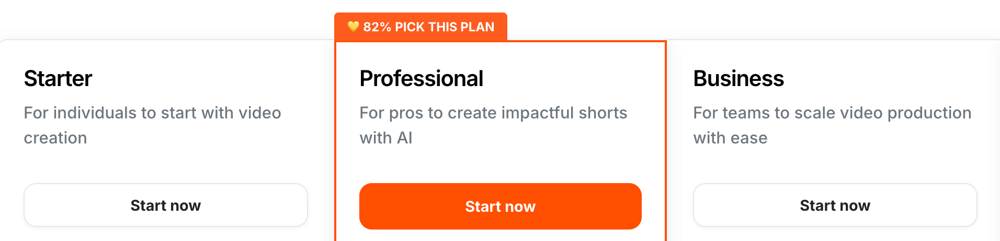

# Submagic Promo Code Valid in 2025

Submagic is currently **the best subtitling SaaS available on the market**. Unfortunately, it's not free: you'll need to subscribe to this service to use it. The good news is that we're explaining here **how to save as much as possible on your Submagic subscription price**. Let's go!

## The Best Submagic Promo Code

The **MA10 code** allows you to get **10% off for life on Submagic**. It's the best promotional code currently valid. No need to look elsewhere, you won't find better!

[▶ Apply the promo code](https://www.submagic.co/?fpr=ma10)

Know that **this coupon can be combined with the annual discount** to get up to 50% off.

## How and Where to Apply This Promotional Code?

The MA10 promotional code activation happens **during payment**.

Here are the steps to follow to access the payment page and activate your discount:

1. [Create an account on submagic.co](https://www.submagic.co/?fpr=ma10)
2. Choose the plan that meets your needs
3. Select annual payment for an additional discount
4. During payment, enter the MA10 code in the designated field.

## How Much Does Submagic Cost?

Submagic offers **3 different plans**: Starter, Professional and Business.

### Submagic Starter

This first plan allows you to **subtitle 15 videos per month**. They can last up to 2 minutes. Result: you'll get more dynamic videos, without watermark, with the ability to add b-rolls and audio.

| Subscription | Monthly | Annual |
|--------------|---------|--------|
| Price without promo code | $19/month | $12/month |
| Price with MA10 code | $18.1/month | $10.8/month |

[▶ Apply the promo code](https://www.submagic.co/?fpr=ma10)

### Submagic Professional

The Professional plan allows you to **subtitle 40 videos per month** (up to 5 minutes per video). It also provides access to **additional features** like automatic silence removal, audio enhancement, and subtitle translation.

| Subscription | Monthly | Annual |
|--------------|---------|--------|
| Price without promo code | $39/month | $23/month |
| Price with MA10 code | $35.1/month | $20.7/month |

[▶ Apply the promo code](https://www.submagic.co/?fpr=ma10)

### Submagic Business

With Submagic Business, you can edit **100 videos per month** (30 minutes max per video). This plan will also allow you to create custom templates and export your videos in 4K/60 FPS for superior quality.

| Subscription | Monthly | Annual |
|--------------|---------|--------|
| Price without promo code | $69/month | $41/month |
| Price with MA10 code | $62.1/month | $36.9/month |

[▶ Apply the promo code](https://www.submagic.co/?fpr=ma10)

Submagic now has an "Enterprise" plan for individuals and organizations with greater needs.

When you choose your subscription, you can also opt for the **Magic Clips** feature at $19/month. It allows you to instantly cut clips from a long video to extract the best moments.

## FAQ About the Submagic Promo Code

**Q: Is the discount obtained with the MA10 code valid for life?**

A: Yes, the MA10 promo code activates a 10% discount for life (valid on your first payment and renewals).

**Q: Does this discount also apply to the Magic Clips feature?**

A: Yes, once activated, the promo code allows you to get 10% off your entire order including Magic Clips. Its price will therefore go from $19/month to $18.1/month with the monthly offer, and from $12/month to $10.8/month with the annual offer.
